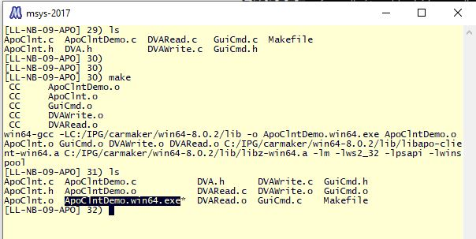

# APO Examples

## APO
The default example from the CarMaker folder.

Path in general:

C:\IPG\carmaker\win64-8.0.2\Examples\APO

## Build APO Example of CarMaker

* Open the msys-2017 which is installed along with CarMaker installation.
* In windows: Generally installed in the path C:/msys-2017
* Click msys.bat
* It will open a terminal
* Change directory the application folder.
* Build the application.

## Basic Terminal commands

* "cd"   : command to Change Directory
* "make" : make or build the application.

### Screen shot of building the application.

Building APO application

